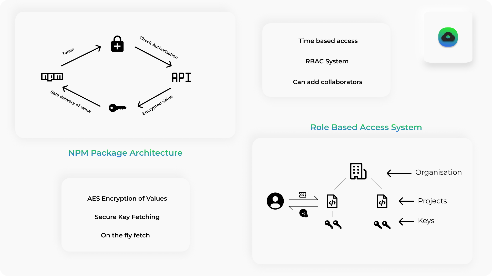

# DotCloud - New way to .env

Tired of sharing the .env file and managing them with your peers ?
DotCloud is the solution.

__DotCloud__ is a safe and smart way to interact with your environment variables.

## How does DotCloud work

- Are you a Project Owner ?
  - SignUp on our portal
  - Create a Project
  - Save the Project token securely
  - Add any collaborators or interns (if you have)
  - Add your project's Key Value pairs on our portal (one last time)

- Are you an Organisation ?
  - SignUp on our portal
  - Create an Organisation
  - Add any collaborators or interns (if you have)
  - Add all the Projects that belong to your organisation

- Are you a collaborator or an Intern?
  - Signup on our portal
  - Save your user key carefully
  - Ask your project owner to add you as a collaborator
  - Fetch the keys you have access to just by using your key, key name and the project name.

## How to Access the Keys ?

- Using our npm package `[Recommended for TS/JS Projects]`
  - Our NPM Package can be found [here](https://www.npmjs.com/package/dotcloud) 
  - Source code for our NPM Package [can be found on GitHub](https://github.com/DarthBenro008/dotCloud)

- Using our API `[For any frameworks]`
  - If you are the project owner, please add the project token otherwise add your user token in the below url.

  - `http://dotcloud.azurewebsites.net/keys/?keyName=`key_name`&projectName=`project_name`&token=`your_token
  - Voila! Enjoy on the fly key fetching and management of yout keys in one place!

Other Important URLs:
  
- [DotCloud npm package](https://www.npmjs.com/package/dotcloud)
- [DotCloud npm Github repo](https://github.com/DarthBenro008/dotCloud)
- [Postman API Documentation](https://indianpost.postman.co/)
